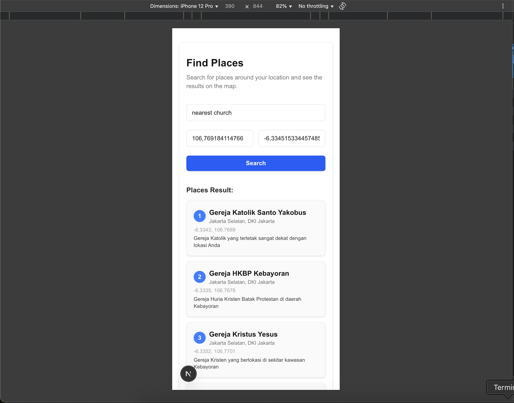
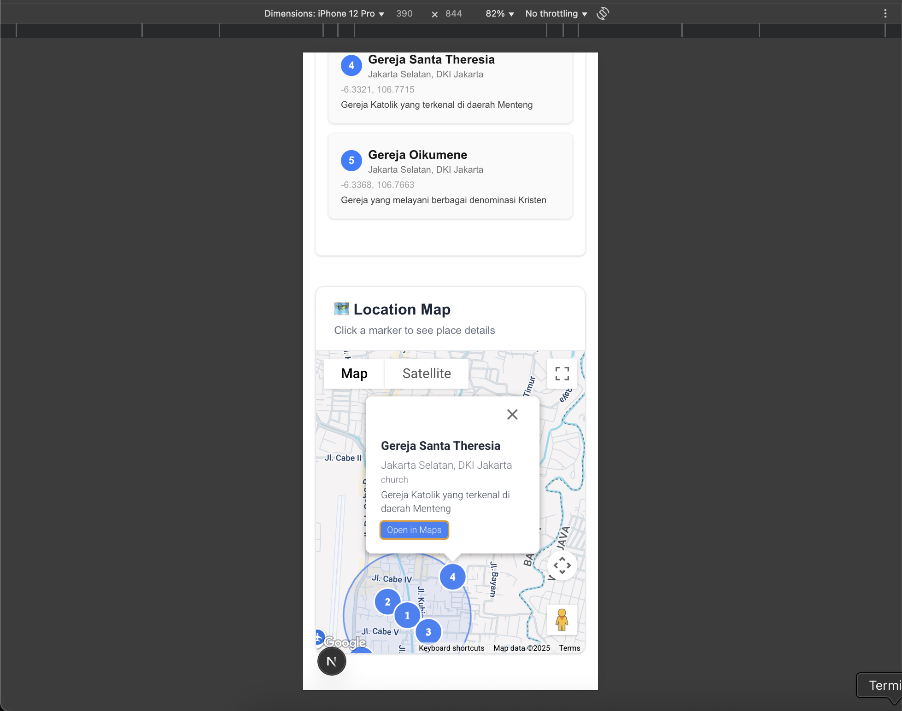

# HeyPico Assessment

## Overview
HeyPico Maps is a location-based place finder web application that leverages LLM (Large Language Model) technology using DeepSeek for semantic search and place recommendations. The project consists of a backend built with Express.js and a frontend built with Next.js (React). Users can search for places of worship (e.g., mosques, churches) near their location, and results are visualized on an interactive map.

---

## Features
- **LLM-powered Search**: Uses DeepSeek LLM to interpret user prompts and return relevant places.
- **Backend API**: Built with Express.js, exposes endpoints for place search.
- **Frontend**: Built with Next.js, provides a modern UI for searching and viewing places on a map.
- **Interactive Map**: Visualizes user location and search results using Google Maps.
- **Responsive Design**: Works well on both desktop and mobile devices.

---

## Architecture
- **Backend**: Express.js server with endpoints for place search, integrating DeepSeek LLM for semantic understanding.
- **Frontend**: Next.js React app for user interaction and map visualization.

---

## Backend API Example
To search for places (e.g., nearest churches), use the following API endpoint:

```bash
curl --location '{base_url}/api/places' \
--header 'Content-Type: application/json' \
--data '{
    "prompt": "nearest church",
    "longitude": -6.1908832,
    "latitude": 106.7981261
}'
```

**Sample Response:**
```json
{
    "queries": [
        {
            "id": 1,
            "name": "Gereja Katedral Jakarta",
            "city": "Jakarta Pusat",
            "province": "DKI Jakarta",
            "country": "Indonesia",
            "latitude": -6.170166,
            "longitude": 106.831375,
            "category": "Church",
            "description": "Roman Catholic cathedral, a historical landmark known for its neo-gothic architecture."
        },
        {
            "id": 2,
            "name": "Gereja Santa Theresia",
            "city": "Jakarta Pusat",
            "province": "DKI Jakarta",
            "country": "Indonesia",
            "latitude": -6.189444,
            "longitude": 106.8325,
            "category": "Church",
            "description": "A large and active Catholic church located in Menteng."
        },
        {
            "id": 3,
            "name": "Gereja Kristus Yesus",
            "city": "Jakarta Pusat",
            "province": "DKI Jakarta",
            "country": "Indonesia",
            "latitude": -6.186111,
            "longitude": 106.832222,
            "category": "Church",
            "description": "Protestant church, also known as GPIB, located near the Bappenas building."
        },
        {
            "id": 4,
            "name": "Gereja HKBP Menteng",
            "city": "Jakarta Pusat",
            "province": "DKI Jakarta",
            "country": "Indonesia",
            "latitude": -6.1925,
            "longitude": 106.836389,
            "category": "Church",
            "description": "Batak Protestant Christian Church (HKBP) in the Menteng area."
        },
        {
            "id": 5,
            "name": "Gereja St. Yakobus - Kelapa Gading",
            "city": "Jakarta Utara",
            "province": "DKI Jakarta",
            "country": "Indonesia",
            "latitude": -6.159722,
            "longitude": 106.906389,
            "category": "Church",
            "description": "A large modern Catholic church in the Kelapa Gading area."
        }
    ],
    "radius": 8.37
}
```

---

## Frontend Screenshots

Below are example screenshots of the frontend UI:

| Search Results Page | Place Details Page |
|--------------------|-------------------|
|  |  |

---

## How to Run

### Backend
1. Go to the `backend` directory:
   ```bash
   cd backend
   ```
2. Install dependencies:
   ```bash
   npm install
   ```
3. Start the server:
   ```bash
   npm run dev
   ```

### Frontend
1. Go to the `frontend` directory:
   ```bash
   cd frontend
   ```
2. Install dependencies:
   ```bash
   npm install
   ```
3. Start the Next.js app:
   ```bash
   npm run dev
   ```
4. Open your browser at [http://localhost:3000](http://localhost:3000)

---

## Tech Stack
- **Frontend**: Next.js, React, Tailwind CSS
- **Backend**: Express.js, DeepSeek LLM
- **Map**: Google Maps API

---

## License
MIT
